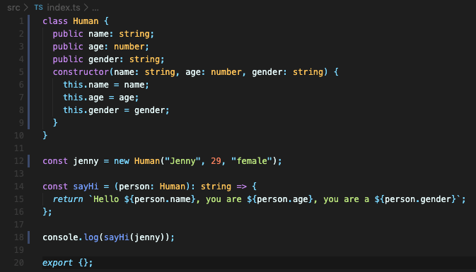

# Typechain

Learning Typescript by making a Blockchain with it (with Nicolas, Nomad Academy)

## 1. TS 환경설정

- TS 설치

```bash
npm -g install typescript # package-lock.json 자동 생성
npm add typescript
```

- `tsconfig.json`: TS -> JS 변환 규칙 명시

- TS -> JS 컴파일 테스트 (`[파일명].ts`, `[파일명].js.map` 생성)
  - **node.js 는 TS를 이해하지 못함**

```bash
tsc
```

- `package.json` 에 `script` 추가 => `npm start` 명령어로 `tsc` + `node index.js` 명령어 실행

```json
"scripts": {
    "start": "node index.js",
    "prestart": "tsc"
  }
```

- `tsc-watch` 설치: TS 변경시 자동으로 컴파일

```bash
npm install tsc-watch --dev
```

```json
// package.json 업데이트 
"scripts": {
    "start": "tsc-watch --onSuccess \"node dist/index.js\" "
  },
```


## 2. 실습

- Protect a developer from stupid mistakes


- Optional parameters (w/ `?`)


- Set assignable type
  - array: `string[]`, `number[]` 와 같이 표현
  - 리턴값이 없는 경우: `void`


- Interface (object handling)


- Class
  - Interface 는 JS로 컴파일 되지 않음 => JS 에 포함시키고 싶을 때는 `Class` 를 사용
    - `Public` / `Private` : 외부에서 해당 property 에 접근 가능 / 불가능 => JS 로는 컴파일 되지 않는 부분임
  - TS 측면에서는 `Interface` 를 사용하는 것이 보다 안정적
  - React, Express, Node 등에 사용할 때는 `Class` 가 필요한 경우가 종종 있음



## 3. 유사 블록체인 구현

- 암호화(해쉬 계산)

  - `$ npm install crypto-js`
  - `import * as CryptoJS from "crypto-js"` : TS 의 import 방식 JS 와 다름
  - `CryptoJS.SHA256([해쉬 계산에 사용할 데이터]).toString;`

- class 의 `static method`
  - 인스턴스 없이 호출 가능
